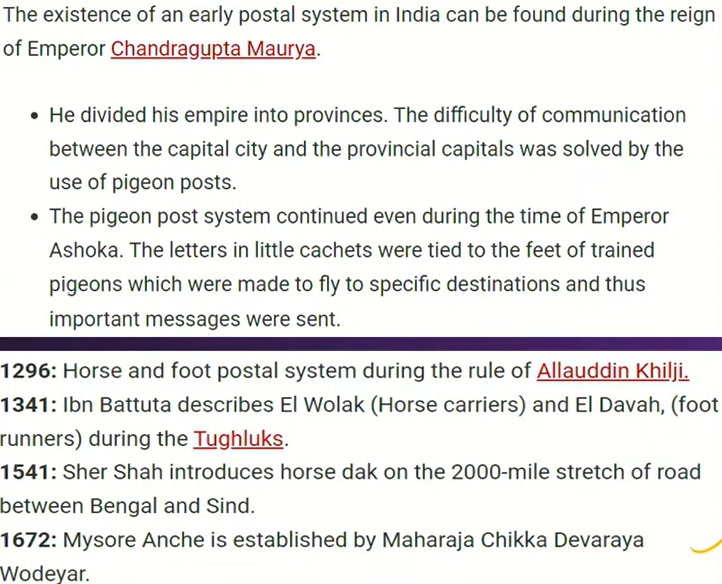
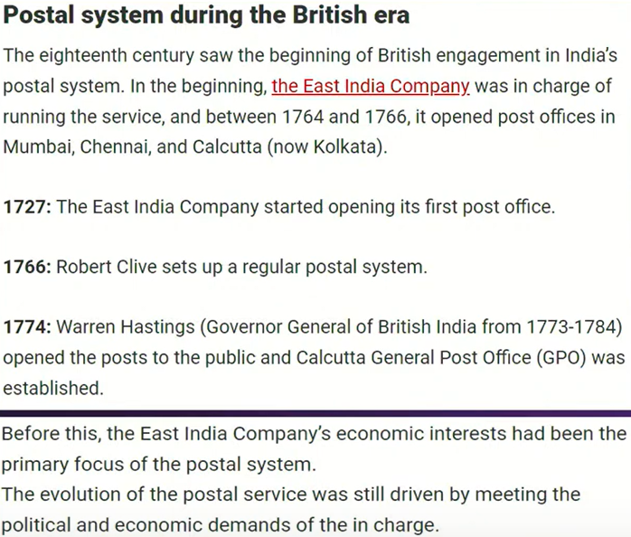

# Polity
- National manuscripts bill 2023
  * MANUSCRIPTS are The treasure of wisdom containig the ancient knowldege system
  
  * india contains around 10 million manuscript `National Mission for Manuscripts` an autonomus body under the Culture Ministry  which mandate with preserving the manuuscripts of india
- new post office bill
  
  

# GOVT SCHEME

- JAL JEEVAN MISSION
  * Launched in 2019 goal is to provide 55 liters per person every day through functional household tap connections (FHTC)
  * Comes under jal shakti ministry
  * fund himalayan and north east states 90:10 other states 50:50 and
  union territories
  * implement source sustainability measures(water source+demand) recharge and reuse grey water management(filter and treatment) water conservation rain water harvesting

  progress 
   - no of household with tap connection has increased more than 20  cores household with tap water connection and more than 70 coverage in 4 years 
   - reduced the dependency on ground water 
   - ease the burden on women 
  demerits
  - major challenge `leakages` supply must be halted for everyone
  - people opinion ground water taste better (because of filtration alters the taste of water)

[GSIMAGES2/]: GS