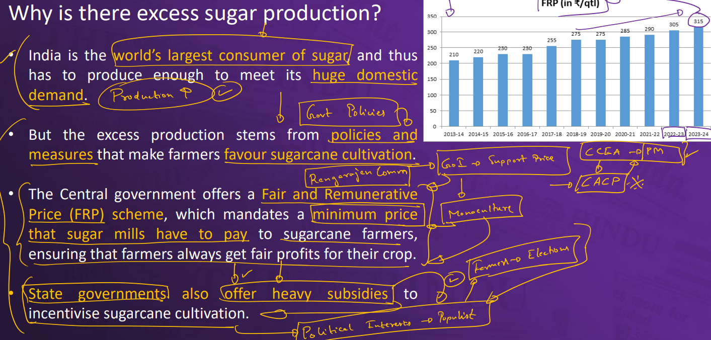

# ECONOMY
 - INDIA'S SUGAR EXPORT CRISIS
   
   
 - INDIA'S MINNING POLICY
 - COMMERCE IS THE LANGUAGE OF NEW AGE POLITICS
 - CLIMATE CHANGE & UMBERALLA FOR URBAN HEALTH
   
# EVIRONMENT AND AGRICULTURE

# SCIENCE AND TECH

 - MATERIAL LK-99 SUPERCONDUTCUR 
  
# SECURITY
 - SC APPOINT ALL WOMEN PANEL TO MANIPUR