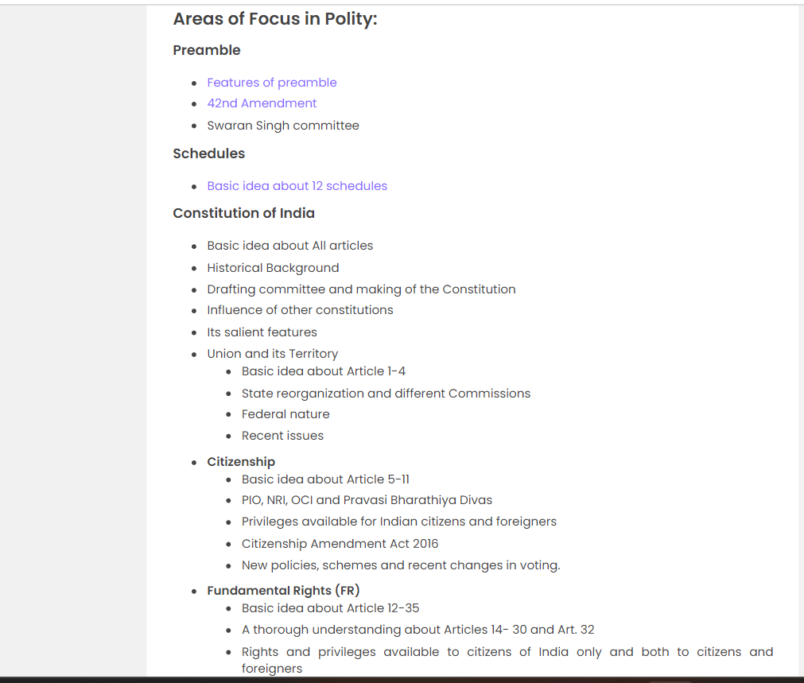

 # Goal: TO BECOME A 'IAS' OFFICER BECAUSE YOU HAVE ONE MOST IMPORTANT RESPONSIBILITY (*****N)

### PRELIMS
- Topper videos
- SYLLABUS
- MATERIALS 
- PREVIOUS YEARS QUESTIONS

### PLAN
 - Daily curreent affaris
 -  PYQ analysis
 -  daily note making
 
 ### DURATION

 - 10 months
  ### 2 MONTHS PLAN

     POLITY PLAN 

     - PYQ analayis
     - each option analysis
     - current affairs relate 
     - value addition (mains)
     - lakshmikanth polity
     - constittution at work (NCERT) 
     - MOCK-TESTS AND REVIEW

### TIMINGINS 
    
    DAILY

    (TUESDAY TO FRIDAY)
    
    - MORNING: 6:30 TO 7:30
    - AFTERNOON: 2:30 TO 3:30 
    - EVENING: 7:30 TO 8:30
    - NIGHT: 9:30 TO 12

    (SATURDAY AND SUNDAY)
    - MORNING: 6:30 TO 7:30
    - IF TIME PERMITS UPTO 8:30
    - AFTERNOON: 2:30 TO 4:30
    - NIGHT: 10:30 TO 12
  

    (MONDAY)
    - MORNING: 7 TO 1
    [WITH ONE HOUR BREAK]

    -  AFTERNOON: 3:30 TO 5:30
    -  

`total hours (tuesday to friday) = finally {20 hours}`

`(sat and sun) = total [12 hours])`

`(monday) total [7 hours]`

## total = 40 hours

### AREAS TO FOUCUS 
  
  
  
  
  

  